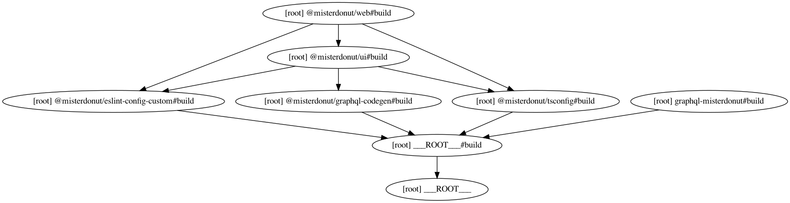

# Misterdonut

Simple CRUD application for verification based on turborepo.

## Getting Started

```
yarn
yarn dev
```

## Install local package to local package

```
npm install @misterdonut/ui -w @misterdonut/web
```

## Dependecies Graph


